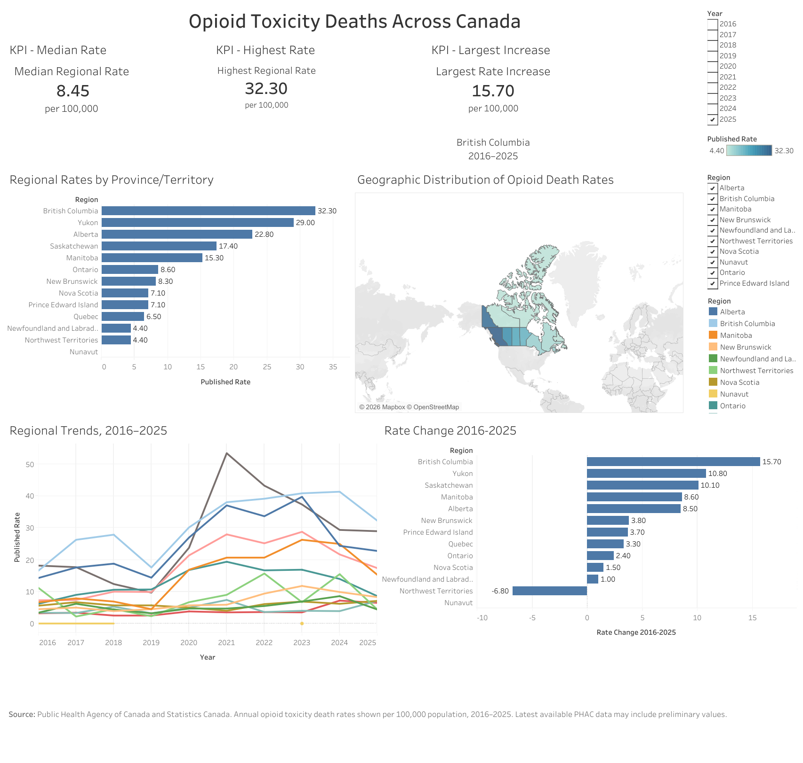

# Canada Opioid Toxicity Deaths Analysis

An end-to-end data analytics project examining opioid toxicity death rates across Canadian provinces and territories from 2016 to 2025.

The project combines **SQL, R, Statistics Canada population data, and Tableau** to clean and validate public health data, investigate regional and temporal patterns, and communicate the results through an interactive dashboard.



## Project Objective

The goal of this project was to examine how opioid toxicity deaths have changed across Canada and identify important regional differences.

The analysis focused on questions such as:

- How have opioid toxicity death rates changed over time?
- Which provinces and territories have experienced the highest rates?
- Which regions experienced the largest changes between 2016 and 2025?
- Can published crude death rates be independently validated using population data?
- Are regional trends adequately described by simple linear relationships?

## Data Sources

### Public Health Agency of Canada

Substance-related harms data covering opioid toxicity deaths and other harm indicators across Canada.

The original dataset contained more than **30,000 records** and included counts, crude rates, percentages, geographic regions, time periods, and suppressed or unavailable observations.

### Statistics Canada

Quarterly population estimates were obtained from Statistics Canada table **17-10-0009-01 — Population estimates, quarterly**.

Population data were integrated with the harms data to independently calculate annual opioid toxicity death rates.

## Tools Used

**Google BigQuery (SQL)**  
Data profiling, cleaning, transformation, joins, validation, aggregation, and creation of the final analysis table.

**R / tidyverse**  
Exploratory analysis, data transformation, visualization, regional comparisons, and nonlinear trend analysis.

**Tableau Public**  
Interactive dashboard development, geographic visualization, KPI reporting, filters, and regional trend exploration.

## SQL Analysis

The SQL workflow followed a raw → clean → analysis structure.

Key tasks included:

- profiling the original substance-harms dataset
- identifying missing, suppressed, and unavailable observations
- converting string-based values into usable numeric fields
- creating standardized year, quarter, and date variables
- cleaning Statistics Canada population estimates
- joining population and opioid death data by region and year
- calculating annual crude death rates
- validating calculated rates against published rates
- comparing harm indicators and regional trends
- producing a final analysis-ready table for R and Tableau

The final dataset contains **130 province/territory-year observations**, representing 13 regions across 2016–2025.

SQL scripts are available in the [`sql`](sql/) folder.

## Rate Validation

To independently validate the published opioid toxicity death rates, quarterly Statistics Canada population estimates were averaged within each region and year.

The crude rate was calculated as:

**Crude Rate = (Annual Opioid Toxicity Deaths / Average Annual Population) × 100,000**

The independently calculated rates closely matched the published rates, providing an additional validation check on the cleaned and integrated data.

Because the exact population denominator methodology used by the source was not assumed, this calculation was treated as an independent approximation rather than an exact reproduction.

## R Analysis

R was used to explore patterns that were better suited to statistical analysis and visualization.

The analysis included:

- regional opioid death-rate trends from 2016–2025
- LOESS smoothing to explore nonlinear patterns
- comparison of regional rates between 2016 and 2025
- absolute and percentage rate changes
- exploratory segmented regression for Alberta

The Alberta analysis estimated a change in trend around **2023**. A Davies test produced a p-value of approximately **0.059**, so the evidence for a structural change was treated as suggestive rather than conclusive.

The complete R analysis is available in [`R/01_r_analysis.R`](R/01_r_analysis.R).

## Key Findings

- Canada's annual opioid toxicity deaths increased substantially over the study period, from **2,832 deaths in 2016 to 5,630 in 2025**.
- British Columbia had the highest published provincial/territorial crude death rate in 2025 at **32.3 deaths per 100,000 population**.
- British Columbia also experienced the largest absolute rate increase between 2016 and 2025, increasing by **15.7 deaths per 100,000**.
- Several regions experienced substantial increases, but the magnitude and timing of changes varied considerably across Canada.
- Northwest Territories showed a decrease between the 2016 and 2025 endpoints.
- Regional trajectories were frequently nonlinear, making a single linear trend inappropriate as a general model for all regions.

## Tableau Dashboard

The interactive Tableau dashboard provides:

- median regional opioid toxicity death rate
- highest regional rate
- largest regional rate increase
- province/territory rate comparisons
- geographic distribution of opioid toxicity death rates
- regional trends from 2016–2025
- regional rate changes between 2016 and 2025
- interactive year and region filters

**Interactive dashboard:** [View on Tableau Public](https://public.tableau.com/app/profile/tina.m8182/viz/CanadaSubstanceHarmsAnalysis/Dashboard1)

## Repository Structure

```text
canada-substance-harms-analysis/
│
├── sql/
│   ├── 01_data_profiling.sql
│   ├── 02_data_cleaning.sql
│   └── 03_data_analysis.sql
│
├── R/
│   └── 01_r_analysis.R
│
├── analysis_opioid_deaths.csv
├── canada_opioid_dashboard.png
└── README.md
```

## Data Considerations and Limitations

There are a few things to keep in mind when interpreting the results:

- Some values in the original dataset were suppressed or unavailable. These were kept as missing values rather than estimated or filled in.
- Some of the most recent data are preliminary, which means the reported values may be updated in the future.
- The analysis uses crude death rates, so differences in factors such as the age distribution of each province or territory are not accounted for.
- Reporting practices can vary between provinces and territories, so regional comparisons should be interpreted with some caution.
- The segmented regression for Alberta was exploratory and based on only ten annual observations, so the estimated change in trend should not be treated as a definitive breakpoint.
- Comparing 2016 with 2025 is useful for showing long-term change, but it does not capture all of the increases and decreases that occurred between those years.

## Skills Demonstrated

`SQL` · `BigQuery` · `R` · `tidyverse` · `Data Cleaning` · `Data Validation` · `Data Integration` · `Exploratory Data Analysis` · `Statistical Modeling` · `Tableau` · `Data Visualization` · `Data Storytelling`
